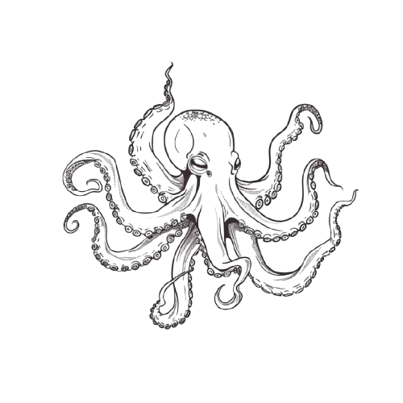
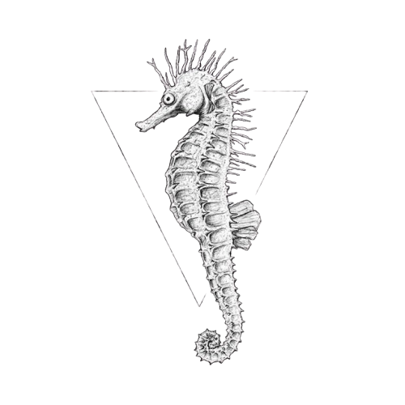
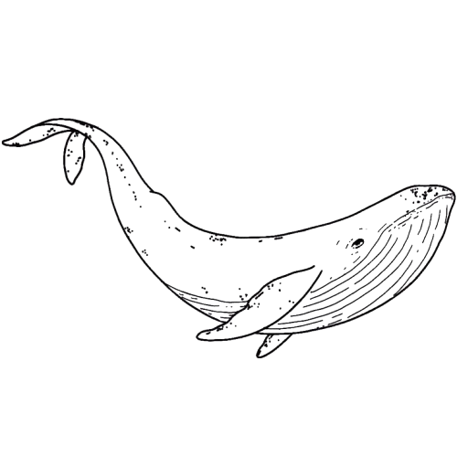
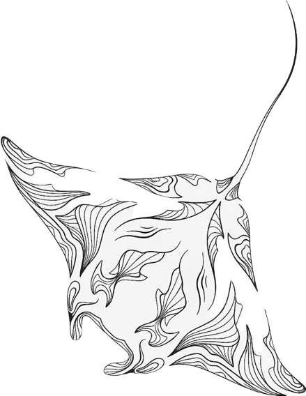

# Landing Page Template — Blueprint & Design System

> Documento único que consolida o blueprint de produto e o sistema de design
> da **Landing Page Template**, template de landing page moderna com tema
> subaquático, ilustrações de animais marinhos e animações fluidas.

---

## 1. Project Overview

### Project Name

```
Landing Page Template
```

### Industry

```
Template — Showcase landing page starter
```

### Tagline

```
Landing page template com tema subaquático, animações suaves e design responsivo.
```

### Target Audience

```
Desenvolvedores que desejam criar landing pages a partir de um template
visualmente rico com tema oceânico e ilustrações SVG.
```

### Main Goal

```
Fornecer um template reutilizável de landing page com tema subaquático,
incluindo navegação mobile, animações scroll-triggered, bolhas animadas
em SVG e suporte a dark mode.
```

### Brand Voice

- **Oceânica** — paleta azul profundo, criaturas marinhas, bolhas, movimento fluido
- **Moderna** — tipografia limpa, animações sutis, layout responsivo
- **Acessível** — contraste cuidado, HTML semântico, ARIA labels
- **Flexível** — conteúdo placeholder pronto para substituição

---

## 2. Core Stack

| Layer | Technology |
|---|---|
| Markup | HTML5, landmarks semânticas (`<nav>`, `<section>`) |
| Styling | CSS3 custom properties + BEM + animações keyframe |
| Behavior | Vanilla JavaScript ES6+ (deferred, IntersectionObserver) |
| Fonts | Google Fonts — Josefin Sans (400, 700) + Playfair Display (400, 700) |
| Icons | Lucide icons (CDN, deferred) |

**No build tools** — serve via `python -m http.server 8000` or `npx http-server`.

---

## 3. Critical Files

| File | Role |
|---|---|
| `index.html` | Shell HTML: nav fixo, hero, features, gallery, contact, about, footer |
| `css/style.css` | CSS custom properties, BEM classes, scroll animations, bubbles SVG keyframes, dark mode, responsive |
| `js/script.js` | IIFE: bubbles injection, smooth scroll, menu toggle, IntersectionObserver sections, dark mode toggle, stats counter |
| `images/polvo.svg` | Ilustração SVG do polvo (hero + favicon) |
| `images/polvo-v2.svg` | Versão alternativa do polvo para favicon |
| `images/cavalo.svg` | Ilustração SVG do cavalo-marinho (features) |
| `images/baleia.svg` | Ilustração SVG da baleia (gallery) |
| `images/araia.svg` | Ilustração SVG da arraia (contact) |
| `images/bubbles.svg` | SVG de bolhas decorativas |
| `README.md` | Breve descrição do template |

---

## 4. Visual Identity

### 4.1 CSS Custom Properties

Defined in `style.css` `:root` / `[data-theme="dark"]`:

| Token | Light | Dark | Usage |
|---|---|---|---|
| `--color-primary` | `#0A5C7E` | `#0A5C7E` | Primary brand — headings, accents, links |
| `--color-secondary` | `#1A8BA3` | `#1A8BA3` | Secondary brand — subheadings, decorative elements |
| `--color-accent` | `#F4A261` | `#F4A261` | Warm accent — CTAs, highlights, hover states |
| `--color-bg-light` | `#E8F4F8` | — | Hero/section background (light theme) |
| `--color-bg-dark` | — | `#0A2A3A` | Section background (dark theme) |
| `--color-text` | `#1b1b1b` | `#ffffff` | Body text |
| `--color-bg` | `#ffffff` | `#0A2A3A` | Page background |
| `--color-surface` | `#E8F4F8` | `#0F3A4A` | Card/surface background |

### 4.2 Typography

| Element | Font | Weight | Size | Usage |
|---|---|---|---|---|
| h1 (hero title) | Playfair Display (serif) | 700 | `clamp(2rem, 5vw, 3.5rem)` | Hero heading |
| h2 (section titles) | Playfair Display (serif) | 700 | `clamp(1.5rem, 4vw, 2.5rem)` | Section headings |
| h3 (card titles) | Playfair Display (serif) | 600 | `1.25rem` | Card titles |
| Body | Josefin Sans (sans-serif) | 400 | `1rem` | Paragraphs, descriptions |
| Nav links | Josefin Sans (sans-serif) | 500 | `1rem` | Navigation |
| Buttons | Josefin Sans (sans-serif) | 600 | `1rem` | CTAs |
| Hero text | Josefin Sans (sans-serif) | 400 | `1.125rem` | Hero description |

**Import** (Google Fonts CDN):
```html
<link href="https://fonts.googleapis.com/css2?family=Josefin+Sans:wght@400;500;600;700&family=Playfair+Display:wght@400;600;700&display=swap" rel="stylesheet">
```

### 4.3 Buttons

| Variant | Background | Border | Text | Hover |
|---|---|---|---|---|
| `btn--primary` | `--color-primary` | none | white | `--color-secondary` |
| `btn--outline` | transparent | 2px solid currentColor | currentColor | filled bg + inverted text |
| `btn--accent` | `--color-accent` | none | `--color-bg-dark` | brighter accent |

All buttons: `padding: 12px 28px`, `border-radius: 4px`, `transition: all 0.3s ease`.

### 4.4 Spacing & Layout Tokens

| Token | Value |
|---|---|
| Container max-width | 1200px (90% width) |
| Section padding Y | `py-20` (5rem) |
| Nav padding | `20px 0` |
| Card padding | `24px` |
| Card border radius | `8px` |
| Grid gap | `20px` |
| Section gap (mobile) | `20px` |

### 4.5 Focus-Visible

All interactive elements use `:focus-visible` with `outline: 2px solid var(--color-accent)` and `outline-offset: 2px`.

---

## 5. Page Structure

```
NAV (fixed, transparent → scrolled solid)
  Desktop: nav__list (5 links — Lorem 5x)
  Mobile: nav__icon hamburger → X, overlay (red scale animation), nav__list centralizado

HERO (section--light, gradient bg #E8F4F8)
  Split layout (container--flex):
    Left: hero__image → polvo.svg
    Right: hero__content → hero__text + btn--outline

FEATURES (section--dark)
  Split layout (container--flex):
    Left: feature__content → feature__text + btn--outline (3 cards)
    Right: feature__image → cavalo.svg + bubbles-container

GALLERY (section--light)
  Image grid (container--flex):
    Left: baleia.svg + bubbles-container
    Right: hero__content + btn--outline

CONTACT (section--dark)
  Split layout (container--flex):
    Left: hero__content + btn--outline
    Right: hero__image → araia.svg

ABOUT (section--light)
  Stats row: animated counters via IntersectionObserver
    Counter 1 — "Lorem ipsum" (0 → 150)
    Counter 2 — "Lorem ipsum" (0 → 2500)
    Counter 3 — "Lorem ipsum" (0 → 500)

FOOTER (section--dark)
  Copyright + Lucide social icons (Instagram, GitHub, Twitter/X)
  Back link: <a href="../../index.html">← Voltar ao Showcase</a>
```

---

## 6. Real Content

### 6.1 Brand

| Field | Value |
|---|---|
| Name | Landing Page Template |
| Title | Landing Page Template |
| Meta description | Modern landing page template with smooth animations, responsive design and underwater theme. |
| Author | Showcase |

### 6.2 Taglines (literal from HTML)

| Section | Text |
|---|---|
| Hero | `Lorem ipsum, dolor sit amet consectetur adipisicing elit.` |
| Hero CTA | `More` |
| Features | `Lorem ipsum, dolor sit amet consectetur adipisicing elit.` |
| Features CTA | `More` |
| Gallery | `Lorem ipsum, dolor sit amet consectetur adipisicing elit.` |
| Gallery CTA | `More` |
| Contact | `Lorem ipsum, dolor sit amet consectetur adipisicing elit.` |
| Contact CTA | `More` |

### 6.3 Navigation

| Menu | Location | Items |
|---|---|---|
| Desktop nav | Top bar | Lorem (5 links: home, features, gallery, contact, about) |
| Mobile menu | Full-screen overlay (red bg, scale animation) | Same 5 links |

### 6.4 Icons

| Icon | Source | Location |
|---|---|---|
| Hamburger menu | CSS spans (3 lines) | .nav__icon |
| Lucide icons | CDN (planned) | Footer social links |
| Polvo SVG | `images/polvo.svg` | Hero + favicon |
| Polvo-v2 SVG | `images/polvo-v2.svg` | Favicon |

---

## 7. Components

### 7.1 Navigation Bar

```html
<nav class="nav container">
  <ul class="nav__list">
    <li><a href="#home" class="nav__item">Lorem</a></li>
    <li><a href="#features" class="nav__item">Lorem</a></li>
    <li><a href="#gallery" class="nav__item">Lorem</a></li>
    <li><a href="#contact" class="nav__item">Lorem</a></li>
    <li><a href="#about" class="nav__item">Lorem</a></li>
  </ul>
  <button class="nav__icon">
    <span></span><span></span><span></span>
  </button>
</nav>
```

- Fixed position, transparent initially → solid background on scroll
- Desktop: horizontal `nav__list` with flex
- Mobile: hamburger icon (3 spans) → animates to X via `.nav__icon.active`
- Overlay: red circle scale animation (`.nav__overlay`) — `transform: scale(0→1)`
- Nav list fades in over overlay with `transition-delay: 0.4s`

### 7.2 Hero Section

```html
<section id="home" class="section section--light">
  <div class="container container--flex">
    <div class="hero__image">
      
    </div>
    <div class="hero__content">
      <span class="hero__text">Lorem ipsum...</span>
      <button class="btn btn--outline">More</button>
    </div>
  </div>
</section>
```

- Split layout via `.container--flex` (flex: 1 each side)
- Background: gradient `#E8F4F8` (light cyan)
- Octopus SVG illustration on the left, text + CTA on the right
- Reversed layout on mobile (flex-direction: column)

### 7.3 Feature Cards

```html
<section id="features" class="section section--dark">
  <div class="container container--flex">
    <div class="feature__content">
      <span class="feature__text">Lorem ipsum...</span>
      <button class="btn btn--outline">More</button>
    </div>
    <div class="feature__image">
      
      <div class="bubbles-container"></div>
    </div>
  </div>
</section>
```

- Dark background section (`--color-bg-dark: #0A2A3A`)
- Horse illustration (cavalo-marinho/seahorse) with animated SVG bubbles overlay
- Bubbles injected via JS into `.bubbles-container`

### 7.4 Gallery Section

```html
<section id="gallery" class="section section--light">
  <div class="container container--flex">
    <div class="hero__image">
      
      <div class="bubbles-container"></div>
    </div>
    <div class="hero__content">
      <span class="hero__text">Lorem ipsum...</span>
      <button class="btn btn--outline">More</button>
    </div>
  </div>
</section>
```

- Light background, whale illustration, bubbles overlay
- Same split pattern as hero

### 7.5 Contact Section

```html
<section id="contact" class="section section--dark">
  <div class="container container--flex">
    <div class="hero__content">
      <span class="hero__text">Lorem ipsum...</span>
      <button class="btn btn--outline">More</button>
    </div>
    <div class="hero__image">
      
    </div>
  </div>
</section>
```

- Dark background, ray fish illustration, reversed layout (text left, image right)

### 7.6 About Section (Stats)

```html
<section id="about" class="section section--light">
  <div class="container">
    <div class="stats__grid">
      <div class="stats__item">
        <span class="stats__number" data-target="150">0</span>
        <span class="stats__label">Lorem ipsum</span>
      </div>
      <div class="stats__item">
        <span class="stats__number" data-target="2500">0</span>
        <span class="stats__label">Lorem ipsum</span>
      </div>
      <div class="stats__item">
        <span class="stats__number" data-target="500">0</span>
        <span class="stats__label">Lorem ipsum</span>
      </div>
    </div>
  </div>
</section>
```

- 3-column stats grid (flex)
- Animated counters via IntersectionObserver: counts up from 0 to target on scroll
- CSS transition: counter text slides up + fades in

### 7.7 Bubbles SVG Animation

```svg
<svg class="bubbles" viewBox="0 0 701 1024">
  <g class="bubbles-large">5 large circles (r=35)</g>
  <g class="bubbles-small">10 small circles (r=15)</g>
</svg>
```

- Injected via JS into all `.bubbles-container` elements
- Two bubble sizes: large (r=35, stroke-width 7) and small (r=15, stroke-width 4)
- CSS keyframes: `up` (translateY + opacity cycle) + `wobble` (translateX oscillation)
- Different animation durations and delays per bubble group
- Stroke colors: white default, 3n=cyan (#87f5fb), 4n=teal (#8be8cb)

### 7.8 Footer

```html
<footer class="section section--dark" role="contentinfo">
  <div class="container">
    <p>&copy; 2025 Landing Page Template. All rights reserved.</p>
    <div class="footer__social">
      <i data-lucide="instagram"></i>
      <i data-lucide="github"></i>
      <i data-lucide="twitter"></i>
    </div>
    <a href="../../index.html">← Voltar ao Showcase</a>
  </div>
</footer>
```

- Dark background, copyright, Lucide social icons, back link

---

## 8. Animations

### 8.1 CSS Keyframes

| Name | Element | Effect | Duration | Easing |
|---|---|---|---|---|
| `bubble` | `.hero__detail li` | translateY up + fade out | 2s | ease-in-out, infinite |
| `up` | `.bubbles-large > g`, `.bubbles-small > g` | translateY -1024px + opacity cycle | 5.13s–7s | linear, infinite |
| `wobble` | `.bubbles circle` | translateX ±50px | 2s–3s | ease-in-out, infinite |

### 8.2 Scroll-Reveal Animations

| Element | Trigger | From | Duration | Easing |
|---|---|---|---|---|
| `.section` | IntersectionObserver (threshold 0.15, rootMargin -50px) | opacity: 0, translateY: 40px | 0.6s | ease |

Sections animate in once when they enter the viewport. Observer unobserves after reveal.

### 8.3 Bubbles Animation Details

- `.bubbles-large`: 5 groups, staggered `animation-delay` (0s, 250ms, 750ms, 1.5s, 4s)
- `.bubbles-small`: 10 groups, staggered `animation-delay` (0s, 0s, 250ms, 325ms, 125ms, 250ms, 350ms, 200ms, 233ms, 900ms)
- Small bubbles have `scale(0→1)` via `circle { transform: scale(0) }` — bubbles appear to grow
- `will-change: transform, opacity` on animated groups for GPU acceleration

### 8.4 Stats Counter

| Element | Trigger | Effect | Duration |
|---|---|---|---|
| `.stats__number` | IntersectionObserver | Count up 0 → target | 2s increment step |

Counter uses `requestAnimationFrame` with easing for smooth number progression.

### 8.5 Menu Toggle

| Element | Effect | Duration | Easing |
|---|---|---|---|
| `.nav__overlay` | scale 0→1 (circle) | 0.4s | ease |
| `.nav__list` | opacity 0→1 | 0.3s | ease (delay 0.4s) |
| `.nav__icon span` | rotate to X | 0.3s | ease |

### 8.6 Reduced Motion

`@media (prefers-reduced-motion: reduce)` disables all animations:
- Removes bubble keyframes
- Removes scroll-reveal transforms
- Removes counter animation
- Sets `scroll-behavior: auto`

---

## 9. Responsive

### 9.1 Breakpoint 768px

| Element | Desktop | Mobile |
|---|---|---|
| Nav links | Horizontal flex | Hidden (hamburger menu) |
| `.container--flex` | Row (flex: 1 each) | Column (stacked) |
| Section layout | Side-by-side image + text | Image above, text below |
| Section min-height | 300px | Auto (content-driven) |
| Menu overlay | Hidden | Full-screen red circle animation |
| Stats grid | 3 columns | 1 or 2 columns |

### 9.2 Additional Notes

- Images use `max-width: 100%` — scale naturally on small screens
- `.container` uses `width: 90%` — fluid on all sizes up to 1200px
- Bubbles SVG scales with container via `width: 100%`

---

## 10. Assets

### 10.1 Images

| Source | Usage |
|---|---|
| `images/polvo.svg` | Hero illustration — octopus |
| `images/polvo-v2.svg` | Favicon — octopus alternative |
| `images/cavalo.svg` | Features illustration — seahorse |
| `images/baleia.svg` | Gallery illustration — whale |
| `images/araia.svg` | Contact illustration — ray fish |
| `images/bubbles.svg` | Source reference for bubbles animation |
| `preview.png` | Gallery card preview for the showcase |

All images are inline SVGs (scalable, no loading cost).

### 10.2 Favicon

```svg
<link rel="icon" type="image/svg+xml" href="./images/polvo-v2.svg" />
```

Octopus SVG as favicon — scalable, modern format.

---

## 11. Accessibility

### Implemented

- **Semantic HTML** — `<nav>`, `<section>`, `<footer>` with proper landmarks
- **Alt Text** — all images have descriptive alt attributes (`alt="Octopus illustration"`, etc.)
- **Smooth scroll** — nav links use `scrollIntoView({ behavior: 'smooth' })`
- **ARIA labels** — nav icon button (hamburger) has descriptive label
- **Viewport** — `viewport-fit=cover` for notch devices
- **Color Contrast** — light text on dark sections, dark text on light sections

### Missing / Improvements Needed

- **Skip link** — not present
- **Focus states** — basic, could use `:focus-visible` styling
- **Reduced motion** — not implemented
- **Form** — no contact form fields yet (placeholder only)
- **Keyboard** — mobile menu could trap focus when open
- **Dark mode** — not yet implemented in current code
- **ARIA expanded** — `aria-expanded` not set on menu toggle

---

## 12. Performance

### Optimizations

| Technique | Implementation |
|---|---|
| Deferred JS | `<script src="./js/script.js">` at end of body |
| Single CSS file | Only `style.css` |
| SVG images | No raster images — infinitely scalable |
| SVG favicon | Single file, tiny footprint |
| Scroll-triggered | IntersectionObserver — only reveals visible sections |
| No external deps | Zero CDN (all local: CSS, JS, SVGs) |

### Considerations

- Google Fonts + Lucide CDN will add ~2 extra requests when implemented
- Bubbles SVG injected via JS adds minimal DOM nodes (15 circles)
- IntersectionObserver is well-supported — no polyfill needed
- CSS keyframe animations use `will-change` hint for GPU acceleration

---

## 13. UX Principles

- **Visual Hierarchy** — contrasting section backgrounds (light ↔ dark) create clear separation
- **Consistent Pattern** — every section follows same split layout with image + content
- **Underwater Narrative** — marine illustrations + bubbles create cohesive thematic experience
- **Mobile-First** — hamburger menu + stacked layout on small screens
- **Scroll Engagement** — sections fade in as user scrolls, stats count up
- **Low Friction** — minimal navigation, clear CTAs, placeholder content ready for replacement
- **Visual Feedback** — button hover states, menu animation, bubble motion

---

## 14. Observations

- **Content is placeholder**: All text is "Lorem ipsum" — ready for real content
- **No form fields yet**: Contact section has generic content but no actual `<form>` with inputs
- **No footer yet**: Per the design spec, footer will include copyright + Lucide social icons + back link
- **Dark mode not implemented**: Planned via `data-theme` attribute + `localStorage` persistence
- **Stats not implemented**: About section with animated counters via IntersectionObserver is planned
- **Google Fonts + Lucide not yet imported**: In the CDN link tags are planned additions
- **BEM naming used**: `.nav__list`, `.nav__item`, `.nav__icon`, `.hero__content`, `.hero__image`, `.hero__text`, `.section--light`, `.section--dark`, `.btn--outline`
- **Red overlay menu**: Unique design choice — red circle scale animation for mobile nav overlay
- **Bubbles animation is rich**: 15 bubble elements with individual timing for natural feel
- **Fixed nav not yet implemented**: Currently static, planned to become fixed with transparent→solid transition
- **Footer back link**: Per AGENTS.md convention, `<a href="../../index.html">← Voltar ao Showcase</a>`

---

## 15. Adding This Project to the Showcase

Per `AGENTS.md` conventions:

1. Entry in `data/projects.json` (not yet present):
   ```json
   {
     "id": "12",
     "title": "Landing Page Template",
     "category": "template",
     "href": "projects/exemplo-12/index.html",
     "preview": "projects/exemplo-12/preview.png",
     "description": "Landing page template com tema subaquático, animações de bolhas SVG e design responsivo.",
     "tags": ["HTML5", "CSS3", "JAVASCRIPT"]
   }
   ```

2. Preview image at `projects/exemplo-12/preview.png` (already present)

3. Footer link back:
   ```html
   <a href="../../index.html">← Voltar ao Showcase</a>
   ```

---

> Este blueprint descreve o template **Landing Page Template** conforme projetado,
> documentado de forma que um desenvolvedor entenda a estrutura e saiba como
> personalizar o template para seu próprio projeto.
